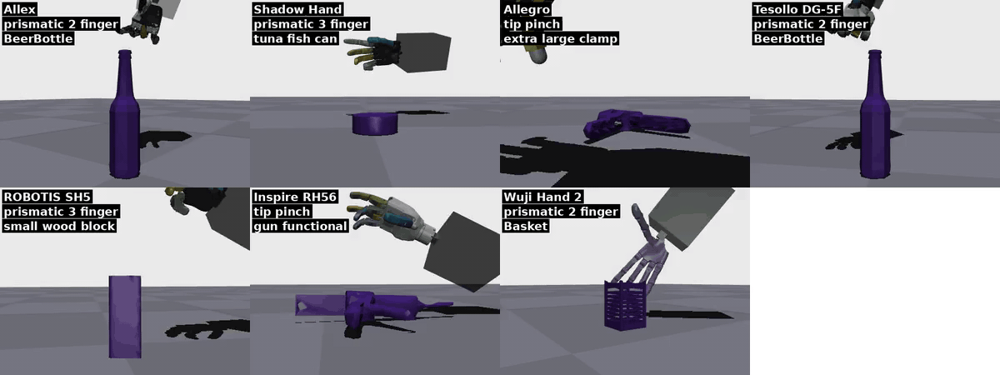
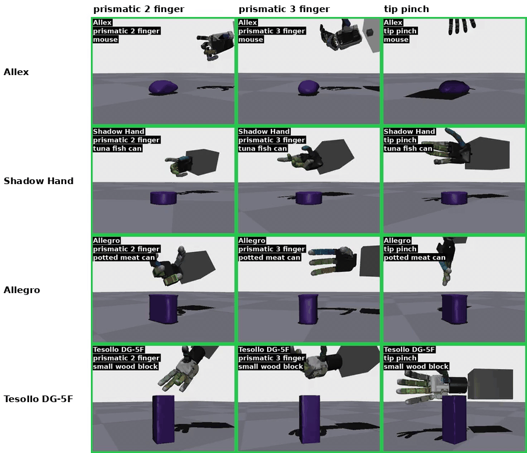
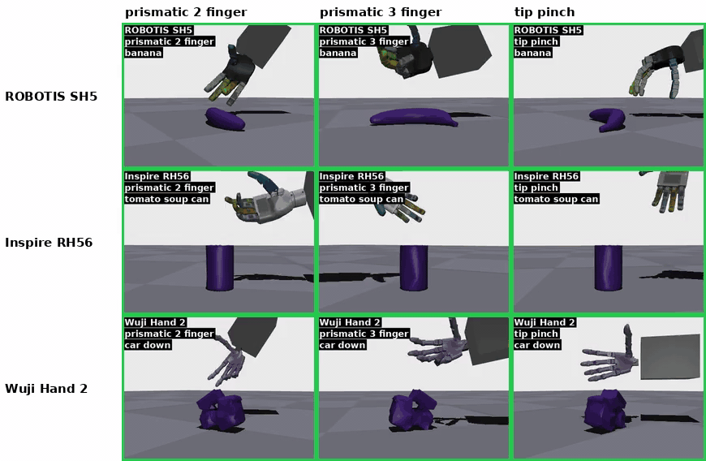

<div align="center">

# Grasping with Sparse Taxonomy

### GPU-parallel dexterous grasping RL with MuJoCo Warp — one env, many hands, teacher → deployable student

[](https://github.com/google-deepmind/mujoco)
[](https://github.com/google-deepmind/mujoco_warp)
[](https://pytorch.org)
[](https://www.python.org)
[](LICENSE)



*Deterministic rollouts of the bundled teacher policies — every tile is a different hand, grasp taxonomy and object.*

</div>

---

## :sparkles: Highlights

* **One task, two policies, three files.** [`grasping_core.py`](grit/training/rl_envs/grasping_core.py)
  holds the grasp-and-lift task (observation blocks, reward mixer, curriculum, re-grasp retry);
  [`grasping_teacher.py`](grit/training/rl_envs/grasping_teacher.py) adds the privileged critic
  and Lagrangian penalty constraints (`env_name: grasping_teacher`);
  [`grasping_student.py`](grit/training/rl_envs/grasping_student.py) swaps in the deployable
  partial-view / masked / history observation (`grasping_student`). One level of inheritance,
  Warp kernels grouped by topic in `grasping_kernels/`. See [docs/ENV.md](docs/ENV.md).
* **Thousands of worlds on one GPU.** MuJoCo Warp simulates 2048 hand + object worlds in
  parallel (~160 k physics steps/s on an RTX 5090); a teacher trains in ~4 h.
* **Six hands in the release, zero per-hand tuning.** Shadow, Allegro, Tesollo DG-5F, ROBOTIS
  SH5, Inspire RH56 and Wuji Hand 2 — same yaml, same reward weights. The WIRobotics Allex hand
  trained with the same recipe and appears in the videos, but its vendor meshes are
  evaluation-only and cannot be redistributed, so its asset, config and checkpoint are not
  included.
  [docs/HANDS.md](docs/HANDS.md) explains how a hand is registered.
* **Teacher → student distillation.** DAgger + hybrid RL turns the privileged teacher into a
  policy that needs no contact sensors, no episode clock and no object tracking after the
  grasp, with a learned re-grasp trigger. [docs/DISTILL.md](docs/DISTILL.md).
* **Interactive parallel-world viewer** with contact markers, ghost target hand and a
  body gizmo, plus headless success-rate and video tools. [docs/EVAL.md](docs/EVAL.md).
* **No private dependencies.** The few simulation helpers the research code took from a lab
  package are re-implemented in `grit/util/sim_core/` (plain `mujoco` + `glfw` + `numpy`).

## :rocket: Getting started

```bash
conda create -n grit_share python=3.12 -y && conda activate grit_share
pip install --index-url https://download.pytorch.org/whl/cu128 torch==2.10.0 torchvision==0.25.0 torchaudio==2.10.0
pip install -r requirements.txt            # mujoco 3.11 · mujoco-warp (pinned commit) · warp 1.16 · …
```

Full instructions (GPU/driver requirements, headless servers, common errors): [docs/INSTALL.md](docs/INSTALL.md).

```bash
# 1. watch a pretrained teacher in the viewer (16 parallel worlds, any hand below)
python scripts/evaluate.py --save-dir pretrained/tesollo_grasping_teacher --hand tesollo --env grasping_teacher --nworld 16

# 2. measure success on 1024 worlds
python scripts/eval_success.py --save-dir pretrained/tesollo_grasping_teacher --hand tesollo --env grasping_teacher --nworld 1024

# 3. train a teacher from scratch (~4 h, 150 M steps) and distil it into a blind student (~3 h)
python scripts/train.py   -c grasping_policy_teacher                                   # tesollo; --overrides 'using_hand_name_list=[shadow]'
python scripts/distill.py -c distill_teacher_to_student                                # from the bundled tesollo teacher
```

Any yaml key can be overridden on the command line (Hydra dot-list):
`--overrides 'using_hand_name_list=[shadow]' nworld=1024 handler.termination.MAX_EPISODE_STEPS=300`.

## :video_game: Demo

Per-hand rollouts (three worlds each, hand · grasp taxonomy · object burned into every tile,
green frame = success) live in the **[gallery](docs/GALLERY.md)**:

| | | |
|---|---|---|
| [Allex](docs/gallery/allex.md) (videos only) | [Shadow Hand](docs/gallery/shadow.md) | [Allegro](docs/gallery/allegro.md) |
| [Tesollo DG-5F](docs/gallery/tesollo.md) | [ROBOTIS SH5](docs/gallery/robotis_sh5.md) | [Inspire RH56](docs/gallery/inspire.md) |
| [Wuji Hand 2](docs/gallery/wuji_hand2.md) | | |

Each hand page lists its rollout video and one collapsible clip per grasp taxonomy (27
taxonomies); [docs/gallery/index.html](docs/gallery/index.html) is a two-drop-down picker
(hand × taxonomy) that plays the clip — open it locally or serve `docs/` with GitHub Pages.
Every clip is a successful world rendered under the evaluation protocol (full episode window,
no early-success reset): approach → the stage rule lifts the wrist target → the wrist is frozen
for the hold phase until the episode ends. Worlds that needed a re-grasp retry are only used
when no retry-free success exists for that hand and taxonomy.

### Same grasp taxonomy, every hand

The finger-pose target the policy imitates is drawn from a 30-class grasp taxonomy (27
classes are shared by all hands shown). Rows are hands, columns three precision taxonomies —
*prismatic 2 finger* (thumb + index pads along the object), *prismatic 3 finger* (thumb +
index + middle) and *tip pinch* (thumb and index fingertips only). **Each hand lifts its own
object, and that object is the same across its row**, so the only thing that changes along a
row is the commanded grasp taxonomy; each cell is a successful world, shot from the palm side
so the participating fingers face the camera:

<p align="center"></p>
<p align="center"></p>

All taxonomies of one hand in one video: `docs/media/taxonomy_<hand>.mp4`; every taxonomy
common to the seven hands: `docs/media/taxonomy_grid_full_{1,2,3}.mp4`; one clip per hand ×
taxonomy with a two-drop-down picker: [docs/gallery](docs/GALLERY.md). Regenerate any subset
with `scripts/make_taxonomy_grid.py` (see [docs/EVAL.md](docs/EVAL.md)).


## :trophy: Model zoo

All teachers: `grasping_teacher`, 30 training objects, 2048 worlds, 150 M control steps, the
`grasping_policy_teacher` recipe with only `using_hand_name_list` changed. No student
checkpoint is bundled — `scripts/distill.py -c distill_teacher_to_student` produces one from
any of these teachers in about three hours (see [docs/DISTILL.md](docs/DISTILL.md)).
Success = strict success on 1024 worlds over one full episode window (`scripts/eval_success.py`,
deterministic policy); lift = object held ≥ 5 cm above its spawn at the end.

| hand | actuators | success \| lift | checkpoint |
|---|---|---|---|
| Shadow Dexterous Hand | 18 | 93.3 % \| 95.8 % | `pretrained/shadow_grasping_teacher` |
| Wonik Allegro | 16 | 92.3 % \| 96.8 % | `pretrained/allegro_grasping_teacher` |
| Tesollo DG-5F | 20 | 89.6 % \| 94.3 % | `pretrained/tesollo_grasping_teacher` |
| Wuji Hand 2 | 20 | 73.0 % \| 86.9 % | `pretrained/wuji_hand2_grasping_teacher` |
| ROBOTIS FFW SH5 | 20 | 86.8 % \| 93.4 % | `pretrained/robotis_sh5_grasping_teacher` |
| Inspire RH56 | 6 | 82.4 % \| 89.4 % | `pretrained/inspire_grasping_teacher` |

Each checkpoint directory holds `config.yaml` (the fully resolved run config) and
`<hand>_<env>_<steps>.pt`; `evaluate.py` / `eval_success.py` / `distill.py` rebuild the exact
training env from it. Numbers: `scripts/eval_success.py`, 1024 worlds, deterministic policy,
one full episode window; *success* = strict (fingers on the taxonomy band and the object in
the lift band at the end), *lift* = object held ≥ 5 cm above its spawn.

## :book: Documentation

| | |
|---|---|
| [docs/INSTALL.md](docs/INSTALL.md) | environment, pinned versions, headless / Xvfb, troubleshooting |
| [docs/ENV.md](docs/ENV.md) | the task: episode phases, observation layout, action, reward terms, presets & flags |
| [docs/TRAIN.md](docs/TRAIN.md) | training loop, config inheritance, the knobs that matter, reading the logs |
| [docs/DISTILL.md](docs/DISTILL.md) | student observation constraints, DAgger + hybrid RL, re-grasp head |
| [docs/EVAL.md](docs/EVAL.md) | viewer keys, success evaluation, video rendering |
| [docs/GALLERY.md](docs/GALLERY.md) | per-hand rollouts, taxonomy clips, interactive picker |
| [docs/HANDS.md](docs/HANDS.md) | the six released hands and how to add one |

## :file_folder: Repository layout

```
Grasping_with_Sparse_Taxonomy/
├── asset/            # hand MJCF + meshes (6 hands), floor / table, 83 tabletop objects
├── config/
│   ├── training/     # base.yaml → grasping_policy_async_best → …_w_ground_force → grasping_policy_teacher
│   │                 # distill_teacher_to_student.yaml · grit_<hand>.yaml (env-only)
│   └── <hand>/       # per-hand env config (asset path, wrist body, gains)
├── data/bps_basis_points.npz
├── docs/             # documentation + media
├── grit/
│   ├── util/         # scene builder (HandUtils), CPU parser, warp kernels (action / cond / partial view), viewer
│   │   ├── sim_core/ # self-contained MuJoCo parser / viewer / transforms / merge_mjcfs
│   │   └── hand_info/<hand>/  # finger / site tables + grasp taxonomy annotations
│   ├── model/        # policies (registry) + observation normaliser
│   └── training/     # orchestrator (GPU scene), SubEnvHandler/BaseRLEnv, PPO, builders, checkpoint, evaluation
│       └── rl_envs/  # grasping_core.py · grasping_teacher.py · grasping_student.py · grasping_kernels/
├── pretrained/       # bundled checkpoints
└── scripts/          # train.py · distill.py · evaluate.py · eval_success.py · render_rollout.py · make_hero_gif.py · make_taxonomy_grid.py
```

## :bulb: How it works, briefly

Each world holds a mocap-driven floating hand and one object on a table. The policy outputs
a wrist Δpose and finger position targets at 25 Hz (8 physics substeps of 5 ms). The
observation is proprioception, the object pose relative to the wrist, a grasp-taxonomy
finger target, a 1024-point BPS shape descriptor and a stage clock; the critic also sees
privileged object state. Episodes run approach → scripted lift → hold, with an automatic
re-grasp retry after a drop and early termination on success. Rewards combine approach /
finger / mimic shaping, contact-quality bonuses (contact ratio, force closure, semantic
contact recall), lift + hold rewards and penalties whose weights are Lagrange multipliers
that rise while a constraint (self-collision, table contact, crushing force, …) is violated.
The student is trained on the same env with sensors masked and a frozen partial-view
shape descriptor. Full description: [docs/ENV.md](docs/ENV.md).

## :page_facing_up: Assets & license

Code: MIT (`LICENSE`). **The assets are not MIT.** Each hand MJCF is adapted from a public
vendor description and keeps that description's license, reproduced as a `LICENSE` file next
to the model — Shadow Hand (Apache-2.0), Allegro (BSD-2-Clause), Tesollo DG-5F (BSD-3-Clause),
ROBOTIS FFW SH5 (Apache-2.0), Wuji Hand 2 (MIT); the Inspire RH56 upstream terms are still
being confirmed. The WIRobotics Allex hand is deliberately **not** distributed: its STL meshes
are released for evaluation only and may not be redistributed. The full source/license table is in
[`asset/dextrous_hand/README.md`](asset/dextrous_hand/README.md). The tabletop objects are taken
from two public dexterous-grasping datasets and keep their original licenses:

* [**GraspXL**](https://github.com/zdchan/graspxl) (Zhang et al., ECCV 2024) — the object set
  prepared by its pipeline (`asset/object/new_training_set`); the 19 YCB objects in it are
  [CC BY 4.0](https://registry.opendata.aws/ycb-benchmarks/), the GraspXL processing is
  CC BY-NC 4.0.
* [**RobustDexGrasp**](https://github.com/zdchan/RobustDexGrasp) (Zhang et al., 2025) — its
  training objects (`asset/object/mixed_train`), released under CC BY-NC 4.0 and derived from
  [ShapeNet](https://shapenet.org/terms) and [PartNet-Mobility](https://sapien.ucsd.edu/about),
  whose terms restrict use to **non-commercial research**. Do not use this folder commercially.

## :pray: Acknowledgements

Thanks to the authors of [GraspXL](https://github.com/zdchan/graspxl) and
[RobustDexGrasp](https://github.com/zdchan/RobustDexGrasp) for releasing their object assets,
which this repository uses as its training and evaluation objects, and to the hand vendors
for their public robot descriptions. The simulator is [MuJoCo](https://github.com/google-deepmind/mujoco)
with [MuJoCo Warp](https://github.com/google-deepmind/mujoco_warp).

## :mortar_board: Citation

If you use this code or the pretrained policies, please cite:

```bibtex
@article{park2026learning,
  title={Learning Dexterous Grasping from Sparse Taxonomy Guidance},
  author={Park, Juhan and Yoon, Taerim and Kim, Seungmin and Kim, Joong-Gil and Ye, Wontae and Park, Jeongeun and Chai, Yoonbyung and Cho, Geonwoo and Cho, Geunwoo and Kim, Dohyeong and others},
  journal={arXiv preprint arXiv:2604.04138},
  year={2026}
}
```
