# Allegro — grasp taxonomies

Teacher policy `pretrained/allegro_grasping_teacher`, one successful world per taxonomy (30 of the 30 taxonomies sampled in the rollout had a successful world; re-grasp successes count). Click a taxonomy to expand its clip; the MP4 link opens the full-rate video.

[← gallery](../GALLERY.md) · [interactive picker](index.html)

<b>adducted thumb</b> ✅ — Basket (<a href="../media/clips/allegro__adducted_thumb.mp4">mp4</a>)

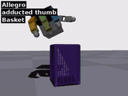

<b>extension type</b> ✅ — large clamp (<a href="../media/clips/allegro__extension_type.mp4">mp4</a>)

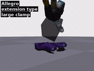

<b>fixed hook</b> ✅ — tomato soup can (<a href="../media/clips/allegro__fixed_hook.mp4">mp4</a>)

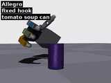

<b>index finger extension</b> ✅ — banana (<a href="../media/clips/allegro__index_finger_extension.mp4">mp4</a>)

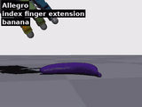

<b>inferior pincer</b> ✅ — bleach cleanser (<a href="../media/clips/allegro__inferior_pincer.mp4">mp4</a>)

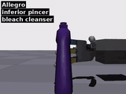

<b>large diameter</b> ✅ — off water body (<a href="../media/clips/allegro__large_diameter.mp4">mp4</a>)

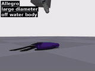

<b>lateral</b> ✅ — mustard bottle (<a href="../media/clips/allegro__lateral.mp4">mp4</a>)

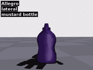

<b>lateral tripod</b> ✅ — small wood block (<a href="../media/clips/allegro__lateral_tripod.mp4">mp4</a>)

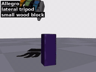

<b>light tool</b> ✅ — mouse (<a href="../media/clips/allegro__light_tool.mp4">mp4</a>)

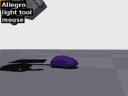

<b>medium diameter</b> ✅ — extra large clamp (<a href="../media/clips/allegro__medium_diameter.mp4">mp4</a>)

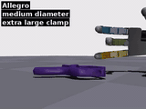

<b>palmar</b> ✅ — Camera (<a href="../media/clips/allegro__palmar.mp4">mp4</a>)

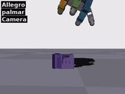

<b>palmar pinch</b> ✅ — BeerBottle (<a href="../media/clips/allegro__palmar_pinch.mp4">mp4</a>)

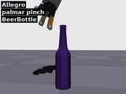

<b>parallel extension</b> ✅ — foam brick (<a href="../media/clips/allegro__parallel_extension.mp4">mp4</a>)

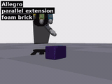

<b>power disk</b> ✅ — Basket (<a href="../media/clips/allegro__power_disk.mp4">mp4</a>)

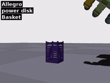

<b>power ring 3f</b> ✅ — tomato soup can (<a href="../media/clips/allegro__power_ring_3f.mp4">mp4</a>)

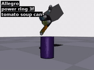

<b>power sphere</b> ✅ — bleach cleanser (<a href="../media/clips/allegro__power_sphere.mp4">mp4</a>)

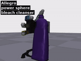

<b>precision disk</b> ✅ — master chef can (<a href="../media/clips/allegro__precision_disk.mp4">mp4</a>)

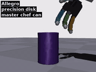

<b>precision sphere</b> ✅ — fan small head (<a href="../media/clips/allegro__precision_sphere.mp4">mp4</a>)

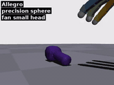

<b>prismatic 2 finger</b> ✅ — gun functional (<a href="../media/clips/allegro__prismatic_2_finger.mp4">mp4</a>)

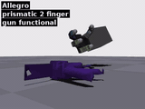

<b>prismatic 3 finger</b> ✅ — fan small head (<a href="../media/clips/allegro__prismatic_3_finger.mp4">mp4</a>)

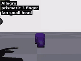

<b>quadpod</b> ✅ — small wood block (<a href="../media/clips/allegro__quadpod.mp4">mp4</a>)

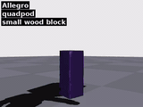

<b>ring</b> ✅ — small tape (<a href="../media/clips/allegro__ring.mp4">mp4</a>)

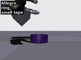

<b>shpere 3 finger</b> ✅ — Basket (<a href="../media/clips/allegro__shpere_3_finger.mp4">mp4</a>)

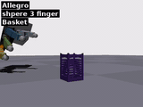

<b>shpere 4 finger</b> ✅ — mustard bottle (<a href="../media/clips/allegro__shpere_4_finger.mp4">mp4</a>)

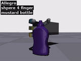

<b>small diameter</b> ✅ — fan small head (<a href="../media/clips/allegro__small_diameter.mp4">mp4</a>)

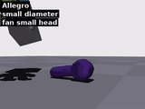

<b>stick</b> ✅ — BeerBottle (<a href="../media/clips/allegro__stick.mp4">mp4</a>)

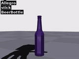

<b>tip pinch</b> ✅ — extra large clamp (<a href="../media/clips/allegro__tip_pinch.mp4">mp4</a>)

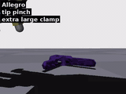

<b>tripod</b> ✅ — extra large clamp (<a href="../media/clips/allegro__tripod.mp4">mp4</a>)

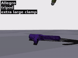

<b>ventral</b> ✅ — foam brick (<a href="../media/clips/allegro__ventral.mp4">mp4</a>)

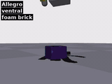

<b>writing tripod</b> ✅ — BeerBottle (<a href="../media/clips/allegro__writing_tripod.mp4">mp4</a>)

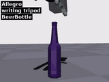

